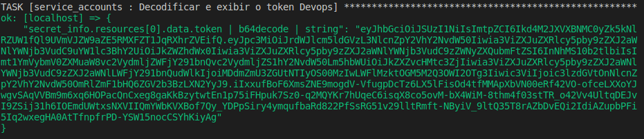
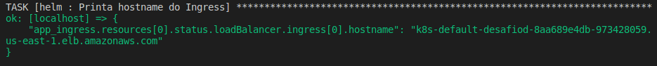
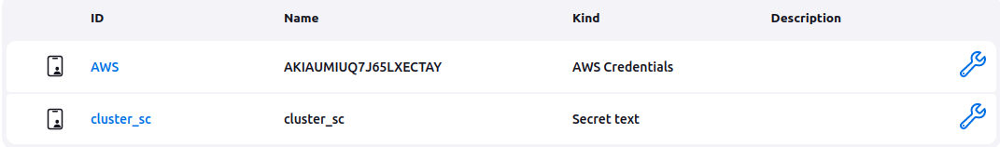
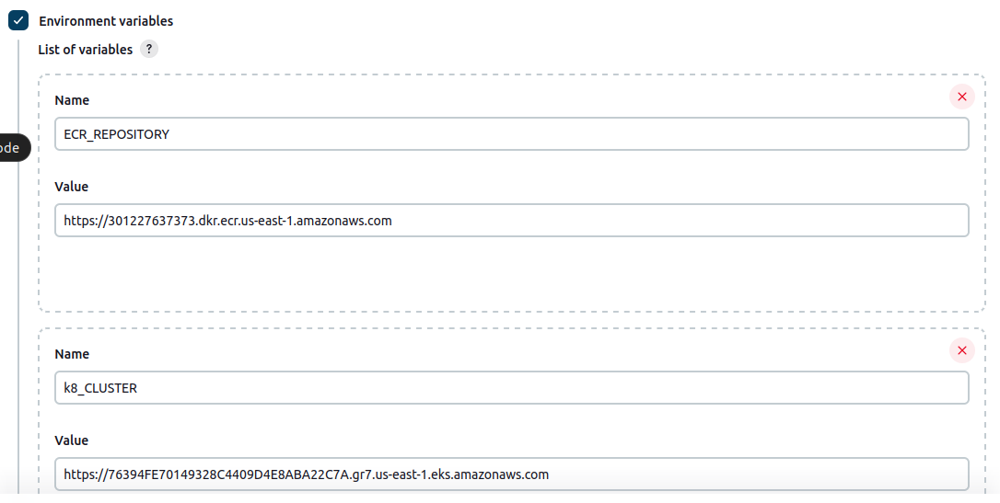
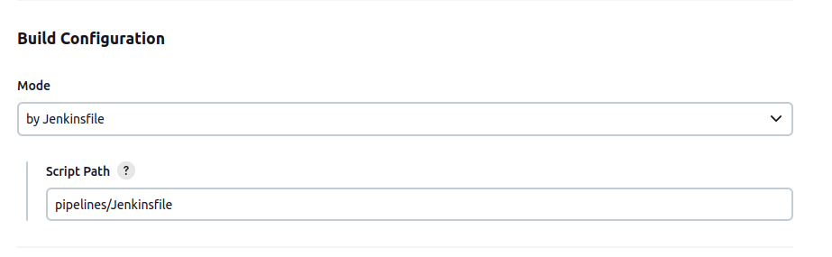
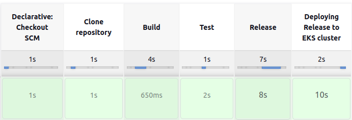
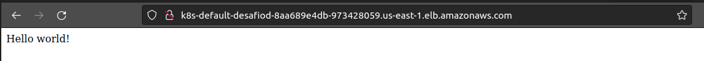
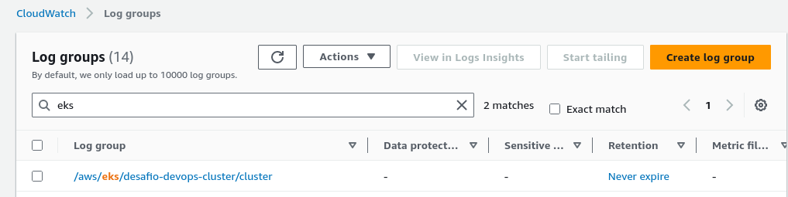
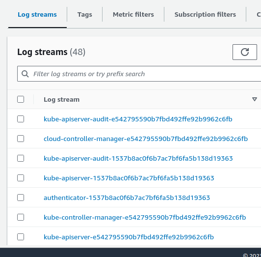

# Documentação do Desafio de DevOps

## Índice
1. [Introdução](#introdução)
2. [Parte 1: Infraestrutura](#parte-1-infraestrutura)
   1. [Ferramentas](#1-ferramentas)
   2. [Comentários sobre a Infraestrutura](#2-comentários-sobre-a-infraestrutura)
   3. [Subindo a Infraestrutura com Terraform](#3-subindo-a-infraestrutura-com-terraform)
   4. [Configuração do ambiente e Instalação de Pacotes com Ansible](#4-configuração-do-ambiente-e-instalação-de-pacotes-com-ansible)
3. [Parte 2: Aplicativo e Pipeline CI/CD](#parte-2-aplicativo-e-pipeline-cicd)
   1. [Ferramentas](#1-ferramentas-1)
   2. [Desenvolvimento do Aplicativo](#2-desenvolvimento-do-aplicativo)
   3. [Configuração da Pipeline Jenkins](#3-configuração-da-pipeline-jenkins)
   4. [Orientações de Configuração Jenkins](#4-orientações-de-configuração-jenkins)
4. [Parte 3: Monitoramento e Logs](#parte-3-monitoramento-e-logs)
5. [Destruindo o ambiente](#destruindo-o-ambiente)

## Introdução
O objetivo deste material é documentar os passos necessários para se reproduzir a implementação
deste desafio, bem como discutir algumas decisões arquiteturais e pontos de atenção/melhoria caso estivéssemos falando de um projeto real para um ambiente produtivo.

## Parte 1: Infraestrutura

### 1. Ferramentas

Para o provisionamento e configuração da infraestrutura, foram utilizadas/serão necessárias as seguintes tecnologias

- arquivo *kubeconfig* funcional
- ansible (2.15.0)
   - Community.Aws
   - Kubernetes.Core
- aws-cli (2.7.30)
- conta ativa na cloud AWS
- helm (v3.10.1)
- kubectl (v1.24.13)
- terraform (v1.4.6)

### 2. Comentários sobre a infraestrutura

A infraestrutura implementa uma VPC e seus principais elementos (redes, tabelas de roteamento, natgateway etc), além de provisionar um cluster EKS com um node-group contendo duas instâncias EC2 em redes privadas, bem como um load-balancer em uma rede pública para expor a aplicação. Também é provisionado um repositório ECR para hospedar as imagens que a aplicação consumirá. Tendo em vista estes pontos, é digno de nota:

- Os nodes do eks residem em uma rede privada, de modo que eles utilizam o natgateway
que reside em uma rede pública para conseguirem fazer requisições para a internet. Isto é fundamental pois os nodes precisam fazer requisições para a internet para baixar novas releases do ECR e para atualizar pacotes.

- Para simplificar o projeto, o load-balancer esta expondo a aplicação diretamente na internet. Em ambientes produtivos, é recomendável criar o load-balancer em uma rede privada e expor a aplicação de forma indireta. Uma solução comum para isto na AWS é se utilizar de um apigateway como porta de entrada para aplicação e este, atraves de um VPC link, irá rotear o tráfego para um load-balancer que, por fim, roteia para a aplicação residente no cluster. Também é recomendável aplicar uma camada de segurança adicionando um WAF na frente do apigateway (ou de um load-balancer). Em ambientes produtivos também é essencial forçar a comunicação via HTTPs do tráfego que se origina da internet. Neste laboratório, porém, toda a comunicação se dará via HTTP.

- Muitas regras de security-group estão permissivas, de modo a simplificar o laboratório.

A organização e estrutura feita para o iac pode ser vista abaixo e é inspirada [neste ebook](https://www.terraform-best-practices.com/key-concepts
).

```sh
iac/
├── envs
│   └── lab
│       └── desafio 
│           ├── locals.tf
│           ├── main.tf # Módulos de infraestrutura
│           └── terraform.tf
└── modules # Módulos de recurso
    ├── ecr
    │   ├── data.tf
    │   ├── main.tf
    │   ├── outputs.tf
    │   ├── terraform.tf
    │   └── variables.tf
    ├── eks
    │   ├── cluster_roles.tf
    │   ├── cluster_sg.tf
    │   ├── cluster.tf
    │   ├── locals.tf
    │   ├── nodes_roles.tf
    │   ├── nodes_sg.tf
    │   ├── nodes.tf
    │   ├── optional_nodes_roles.tf
    │   └── variables.tf
    └── vpc
        ├── main.tf
        ├── outputs.tf
        └── variables.tf
```
### 3. Subindo a infraestrutura com *terraform*

Este projeto pressupõe a existência de um profile pré-configurado para as credenciais de sua conta AWS. Este laboratório usa o profile padrão cujo nome é *default*. Maiores detalhes sobre como configurar profiles para suas credenciais podem ser lidos [nesta pagina](https://docs.aws.amazon.com/cli/latest/userguide/cli-configure-files.html)

Este projeto não guarda o estado em um backend-remoto, e sim localmente. Um exemplo de como configurar um backend remoto no s3 pode ser visto no trecho comentando presente em *iac/envs/lab/desafio/terraform.tf*. Maiores detalhes de boas práticas com backends para AWS podem ser e vistos [aqui](https://aws.amazon.com/blogs/opensource/kubernetes-ingress-aws-alb-ingress-controller/).


Para subir a infraestrutura, siga os passos abaixo:

```sh
cd iac/envs/lab/desafio
terraform init && terraform apply --auto-approve

# caso queira listar os recursos criados, faça:
terraform state list
```

Toda a infraestrutura será criada na região de norte virgínia (us-east-1)

### 4. Configuração do ambiente e instalação de pacotes com ansible

A estrutura para o ansible pode ser vista na pasta *ansible*:

```sh
ansible/
├── clear.sh
└── eks
    ├── roles
    │   ├── helm
    │   │   ├── tasks
    │   │   │   └── main.yaml
    │   │   ├── templates
    │   │   │   └── ingress.yaml
    │   │   └── vars
    │   │       └── main.yaml
    │   ├── iam
    │   │   ├── policies
    │   │   │   └── lb_ingress_policy.json
    │   │   ├── tasks
    │   │   │   └── main.yaml
    │   │   └── vars
    │   │       └── main.yaml
    │   └── service_accounts
    │       ├── tasks
    │       │   ├── balancer.yaml
    │       │   ├── devops.yaml
    │       │   └── main.yaml
    │       └── vars
    │           └── main.yaml
    └── seed.yaml
```

Agora que temos nossa infraestrutura no ar, precisamos fazer algumas configurações no cluster. O objetivo principal que queremos chegar com estas instalações é provisionar e configurar o plugging *AWS ALB Ingress Controller*. Um artigo bem interessante mostrando as características e vantagens de se utiliza-lo pode ser visto [aqui](https://aws.amazon.com/blogs/opensource/kubernetes-ingress-aws-alb-ingress-controller/). O ansible também criará o *ingress* em sí.

Além disto, também usaremos o ansible para criar um *service-account* que será usado por nossa pipeline Jenkins, de modo a permitir a comunicação com nosso cluster Kubernetes.

## Antes de Rodar o Playbook

Antes de executar o playbook, siga as etapas abaixo para fazer as alterações necessárias nos arquivos correspondentes:

### 1. Configuração do Contexto Kubernetes

No arquivo `ansible/eks/seed.yaml`, localize a variável `K8S_AUTH_CONTEXT` e substitua o valor pelo contexto que deseja utilizar.

### 2. Configuração dos *service accounts*

No arquivo `ansible/eks/roles/service_accounts/vars/main.yaml`:

- Substitua o valor da variável `account_id` pelo ID da sua conta AWS. Certifique-se de usar o ID da conta apontada pelo perfil `default`.

### 3. Configuração das Políticas IAM

No arquivo `ansible/eks/roles/iam/vars/main.yaml`:

- Substitua o valor da variável `account_id` pelo ID da sua conta AWS. Certifique-se de usar o ID da conta apontada pelo perfil `default`.
- Substitua o valor da variável `k8_cluster_id` pelo ID do cluster EKS que foi provisionado anteriormente usando o Terraform.

## Executando o Playbook

Após as alterações acima, da raiz do projeto rode o playbook com o comando abaixo:

```sh
ansible-playbook ansible/eks/seed.yaml
```

No output terão duas informações fundamentais:
-  um *token*. Tome nota deste token pois iremos usa-lo posteriormente para configurar a comunicação do *Jenkins* com o cluster Kubernetes. Exemplo do *output* pode ser visto na imagem abaixo:



- A url do load-balancer criado. Esta será a porta de entrada para nossa aplicação. Guarde-o pois após realizarmos o deploy via helm com a pipeline, será este o endereço que deveremos acessar no browser. Exemplo do *output* pode ser visto na imagem abaixo:




## Parte 2: Aplicativo e Pipeline CI/CD

### 1. Ferramentas
 - Docker (24.0.2)
 - Python (3.10.12)
 - Pip (22.2.2)

### 2. Desenvolvimento do Aplicativo

   O aplicativo é um programa simples em *Flask* que retorna uma mensagem em uma rota HTTP utilizando o *Gunicorn*. O Docker é utilizado para empacotar o aplicativo e para garantir que a aplicação terá o mesmo comportamento independente do ambiente. Foi utilizado o *pytest* para viabilizar um teste simples par verificar a saúde da aplicação. Isto será usado em um dos estágios de nossa pipeline. Toda a lógica da aplicação pode ser vista na pasta *api*:

   ```sh
   api
   ├── dockerfile
   ├── hello.py
   ├── requirements.txt
   └── test.py
   ```

### 3. Configuração da Pipeline Jenkins

   As configurações referentes ao *Jenkins* podem ser vistas na pasta *pipelines*:

   ```sh
   pipelines/
   ├── dockerfile
   └── Jenkinsfile
   ```

   Neste laboratório utilizaremos o Jenkins como servidor de automação via uma imagem docker
   customizada. Esta imagem customizada **já irá pré-instalar os pluggins** necessários para o nosso laboratório, que são:

   - kubernetes-cli
   - aws-credentials
   - amazon-ecr
   - docker-workflow

   Rode os comandos abaixo para executar a imagem customizada e atente-se aos pontos de atenção comentados:

   ```sh
      # da raiz do projeto, builde a imagem jenkins
      docker build -t jenkins pipelines/

      # Rode o container:
      docker run -p 8080:8080 -p 50000:50000 -d -v /var/run/docker.sock:/var/run/docker.sock -v jenkins_home:/var/jenkins_home jenkins:latest
      # bind-mount feito acima em -v /var/run/docker.sock:/var/run/docker.sock
      # possivelmente não rodará em sistemas Windows por conta das diferenças entre sistemas de arquivos

      # pegue o id do container Jenkins
      docker ps
      # Entre no container e ajuste as permissões
      docker exec -it -u root <container_id> bash
      chmod 666 /var/run/docker.sock # só disponivel em tempo de execução, pois é gerado via bind-mount
      # Saia do conteiner
      exit
   ```

   OBS: Para rodar o Jenkins dentro do docker de forma simplificada, pode-se seguir os passsos da [documentação](https://www.jenkins.io/doc/book/installing/docker/)

### 4. Orientações de configuração Jenkins

Para que a pipeline funcione corretamente, é preciso configurar as credenciais e variáveis
globais. 

No que diz respeito a credenciais, serão duas: 

- uma credencial do tipo  *AWS Credentials* (na qual você irá configurar o mesmo usuário apontando por seu profile *default*)
- uma credencial do tipo *secret-text*, que conterá o token gerado no ansible que foi discutido anteriormente <aqui>

Na imagem abaixo há um exemplo visual. Note que é interessante manter os mesmos IDs do exemplo,
pois a pipeline implementada no *Jenkinsfile* não esta tão flexível no que diz respeito a nomes de variáveis.



No que diz respeito a variáveis globais, serão duas: 

- ECR_REPOSITORY
- K8_CLUSTER

Na imagem abaixo há um exemplo visual. Note que é interessante manter os mesmos *name* do exemplo,
pois a pipeline implementada no *Jenkinsfile* não esta tão flexível no que diz respeito a nomes de variáveis. Os *values*, naturalmente, deverão ser os valores de seu case em questão.



Lembre-se de nas configurações da pipeline, apontar a referencia para o *Jenkinsfile* no path esperado:



Feita essas configurações - e partindo do pressuposto que foram feitas as configurações básicas do Jenkins (criação do usuario, criação da pipeline, associação da pipeline com o repositório etc), basta rodar a pipeline.



Após a pipeline finalizar, use o link do loadbalancer discutido anteriormente para acessar a aplicação no navegador



A pipeline usa o HELM para deployar o chart de nossa api. Para simplificar, os serviços e deployment foram criados no namespace *default*. As configurações usadas pelo
helm podem ser vistas na pasta *k8*:

```sh
k8/
└── api
    ├── Chart.yaml
    ├── templates
    │   └── api.yaml
    └── values.yaml
```

Principais pontos de melhorias nas pipelines:

- A pipeline poderia ser mais genérica e flexível no que diz respeito a nomes de variáveis
- No stage final (deploy via *Helm*) a pipeline poderia ser melhorada para perceber se deve-se fazer um *helm install* ou um *helm upgrade*, evitando-se possíveis erros em runs sucessivos.

## Parte 3: Monitoramento e Logs

Observabilidade é um ponto fundamental para a evolução de manutenção de qualquer produto. Quando se fala de kubernetes, há duas frentes principais que merecem especial atenção:

- Monitorar os node *Control-Plane* (os master, que gerenciam outros nodes)
- Monitorar *Work nodes* (os nodes que hospedarão e executarão as aplicações)

Em nosso IAC, habilitamos, no que diz respeito ao *Control-Plane*, os seguintes tipos de logs:
- Authenticator
- API server
- Audit
- Controller manager
- Scheduler


Eles são integrados com o serviço do Cloudwatch da aws e podem ser encontrados na sessão *loggroups* do mesmo, conforme as imagens abaixo:





Embora interessantes, com as ferramentas-padrão disponibilizadas pelo Cloudwatch da aws, não temos muita facilidade para investiga-los (podemos usar o query-insigths com baixo esforço, mas não é tão poderoso quanto ferramentas dedicadas). Além disso, logs são diferentes de monitoração, portanto, é necessário, também, ferramentas de monitoramento. O cloudwatch da AWS também oferece isto, mas ferramentas dedicadas podem ser mais interessantes. Além disto, estes logs dizem respeito apenas aos nodes do tipo *Control-Plane*

Um ponto de atenção sobre subir stacks como prometheus(monitoramento)/loki(coleta e centralização de logs)/grafana(visualização amigável) é que é **importante garantir que elas não serão afetadas caso o cluster principal fique com problemas**. Por isto, é interessante pensar nas seguintes estratégias:

 - Caso a stack de observabilidade seja feita no cluster, garanta que os services e pods referentes a observabilidade sejam criados em *nodes dedicados para este fim*
 - Pode-se subir stack de observabilidade em um cluster/grupo de servidores completamente apartados do cluster no qual queremos monitorar
 - Usar serviços da cloud dedicados a isto. Como por exemplo [AWS Managed Service for Prometheus](https://aws.amazon.com/pt/prometheus/)
   - este serviço integra de forma fácil e amigável com o serviço EKS, usado neste lab

## Destruindo o ambiente

Note que este projeto gera recursos que podem ser caros (só o cluster EKS custará, pelo menos, na faixa dos $70/mês!!). Nesse sentido, é fundamental destruir o ambiente após os testes. Para isto, siga as etapas abaixo:

```sh
# PASSO 1:
cd iac/envs/lab/desafio
terraform destroy --auto-approve
# o comando acima já irá destruir o cluster EKS e a maior parte do recursos da VPC,
# bem como todos os recursos que geram custos elevados.

# Porém não será possível remover todos os recursos de uma vez em virtude da dependência de recursos de redes gerados pelo ansible

# PASSO 2:
# removendo recursos gerados indiretamente pelo ansible
cd ansible
./clear.sh
# o script acima irá remover o ingress e as associações de redes criadas pelo ansible

# Repita os passos 1 e 2 até que todos os recursos sejam removidos


# OBS: Lembre-se de deletar manualmente na console da AWS qualquer imagem contida no repositório
# ECR, caso contrário, o terraform não irá remover o repositório ECR.
```